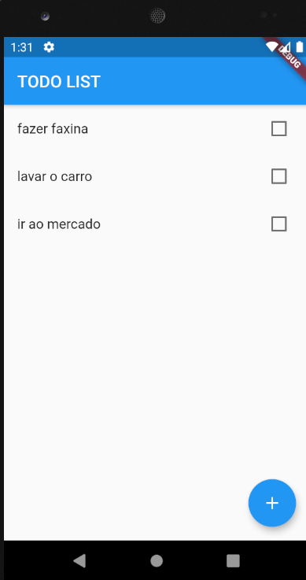
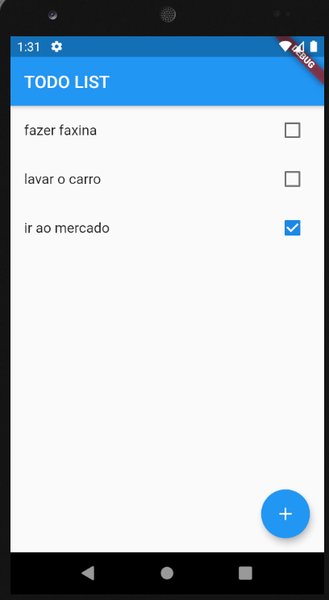
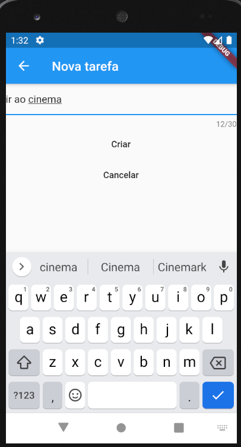

# todo_sqflite

A to-do list app that demonstrates various concepts in Flutter and Dart: Asynchronous programming, GestureDetector, on-screen alerts, Checkbox, FlatButton, navigation and passing parameters between screens and more ...
Implemented with a local Sqlite database, but with a simple change with interface programming.

